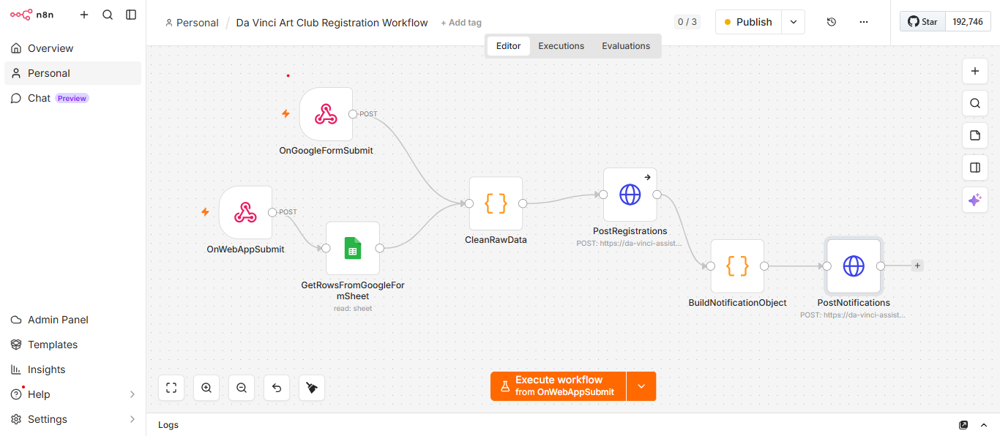

# Da Vinci Assist – Automatisation des inscriptions

## Présentation

Da Vinci Assist est une application de gestion destinée à une association d’art. L’un des principaux défis rencontrés concernait la gestion des inscriptions via Google Form : les données étaient stockées dans un Google Sheet avec des formats hétérogènes et nécessitaient une saisie manuelle dans l’application.



Pour résoudre ce problème, j’ai conçu un système d’automatisation basé sur **n8n** et **Google Apps Script**. Lorsqu’un utilisateur soumet une inscription, un script Apps Script transmet automatiquement les données à un workflow n8n. Celui-ci nettoie et normalise les informations avant de les envoyer à l’API de l’application pour créer le membre et générer une notification. Le workflow n8n est disponible dans [davinci-registration-workflow.json](./davinci-registration-workflow.json) et le code Google Apps Script dans [app-script.gs](./app-script.gs)

Un autre WebHook node permet également de synchroniser l’ensemble des inscriptions déjà présentes dans le Google Sheet afin de garantir la cohérence des données.

Cette automatisation a permis de supprimer les tâches de saisie répétitives, de réduire les erreurs humaines et d’assurer un traitement quasi instantané des nouvelles inscriptions. Ce projet m’a également permis d’apprendre en autonomie l’intégration d’outils d’automatisation, la conception de workflows événementiels et leur connexion à une application web développée avec **Next.js**, **Spring Boot** et **n8n**.

---

## Tester le flux d'automatisation

L'application est accessible dans un environnement de démonstration à l'adresse suivante :

**Application :**
https://da-vinci-assist-frontend.onrender.com/

**Google Form d'inscription :**
https://docs.google.com/forms/d/e/1FAIpQLSehU926U5domn6zn_js_AccEjAc1TC74p4och4LUglbyAtyUw/viewform

### Étapes de test

1. Ouvrir l'application dans un premier onglet et se connecter avec les identifiants de démonstration fournis ci-dessous :

```text
email: testprod@gmail.com
password: admin
```

2. Dans un second onglet, ouvrir le Google Form et soumettre une nouvelle inscription en utilisant un numéro étudiant (ETU) facilement identifiable (ex: 3173).

3. Revenir sur l'application. Une notification devrait apparaître automatiquement pour indiquer qu'une nouvelle inscription a été traitée.

4. Accéder à la page **Membres** et rechercher le numéro étudiant (ETU) renseigné dans le formulaire afin de vérifier que le membre a bien été créé.

5. En cas d'échec lors du traitement ou de l'insertion des données, une notification d'erreur est également générée dans l'application afin de faciliter le suivi des incidents.

---

## Stack technique

* Frontend : Next.js, React, Tailwind CSS
* Backend : Spring Boot
* Automatisation : n8n, Google Apps Script
* Base de données : PostgreSQL
* Déploiement : Render
